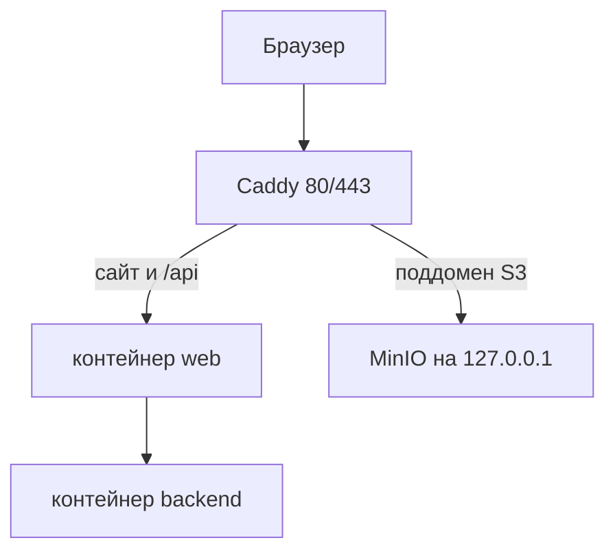
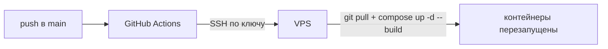

# Деплой на VPS Timeweb (домен aemanskova.ru)

Пошаговое руководство по выкладке **student-code-analyzer** на выделенный сервер Timeweb с Docker, reverse proxy (Caddy) и TLS. Схема и домен в тексте приведены как пример (**aemanskova.ru**, **s3.aemanskova.ru**); подставьте свой домен везде, где он нужен.

---

## Содержание

1. [Как устроен трафик](#1-как-устроен-трафик)
2. [Требования и что подготовить заранее](#2-требования-и-что-подготовить-заранее)
3. [Сервер и DNS](#3-сервер-и-dns)
4. [Docker на VPS](#4-docker-на-vps)
5. [Каталоги данных и права](#5-каталоги-данных-и-права)
6. [Код и файл `.env`](#6-код-и-файл-env)
7. [Переменные, специфичные для `docker-compose.prod.yml`](#7-переменные-специфичные-для-docker-composeprodyml)
8. [Запуск стека](#8-запуск-стека)
9. [HTTPS и Caddy](#9-https-и-caddy)
10. [Проверки после деплоя](#10-проверки-после-деплоя)
11. [Обновление приложения](#11-обновление-приложения)
12. [Логи и отладка](#12-логи-и-отладка)
13. [Файрвол](#13-файрвол)
14. [CI/CD через GitHub Actions](#14-cicd-через-github-actions)
15. [Типичные проблемы](#15-типичные-проблемы)
16. [Что уже усилено в приложении](#16-что-уже-усилено-в-приложении)

---

## 1. Как устроен трафик

- В браузере пользователь открывает **один origin** — например `https://aemanskova.ru`.
- Статика SPA и маршрутизация фронта отдаётся **nginx** внутри контейнера `web`.
- Запросы к API идут на **тот же хост**, путь **`/api`** (в `frontend/nginx/default.conf` прокси на `http://backend:3000/api/`). Таймауты прокси до 1 часа, тело запроса до **512 MB** — под долгие анализы и загрузки архивов.
- Контейнер **backend** в `docker-compose.prod.yml` **не публикует порт наружу**: только внутренняя сеть Docker.
- **MinIO** (S3 API) слушает на хосте только **127.0.0.1** (например `9100`), в интернет не выходит. Браузер ходит в хранилище по **публичному HTTPS** — отдельный поддомен, например `https://s3.aemanskova.ru`, который проксирует Caddy на `127.0.0.1:9100`.
- Рекомендуемая схема: на хосте **Caddy** принимает **80/443**, выдаёт TLS, проксирует на **`127.0.0.1:8080`** (контейнер `web`, см. `WEB_PORT`) и на `127.0.0.1:9100` (MinIO API). Порты **9100/9101** в публичный фаервол не открывать.



Backend обращается к MinIO по внутреннему адресу Docker `http://minio:9000` (см. `S3_ENDPOINT` в `.env`).

---

## 2. Требования и что подготовить заранее

- VPS с Ubuntu **22.04** или **24.04**, доступ по SSH.
- Домен **A**-записью на публичный IP VPS (и при необходимости поддомен для MinIO).
- Доступ к репозиторию с проектом (git clone по HTTPS/SSH).
- Понимание, что секреты живут только в **`.env`** на сервере и не коммитятся в git.

Дополнительная документация: **`SECURITY_FIXES.md`** (что сделано по безопасности), **`.env.example`** (полный список переменных с комментариями).

---

## 3. Сервер и DNS

1. В панели Timeweb у VPS выберите ОС (Ubuntu 22.04/24.04). Наружу по возможности только **22** (SSH), **80** и **443**; порты MinIO напрямую не открывать.
2. **A**-запись: `aemanskova.ru` → IP VPS.
3. Для загрузок в S3 из браузера: **A** (или **CNAME**) для **`s3.aemanskova.ru`** (или ваш поддомен) на тот же IP.
4. При использовании **www**: либо отдельная **A** на тот же IP, либо **CNAME** `www` → `aemanskova.ru`; в `.env` и `MINIO_CORS_ORIGINS` перечислите оба origin, если нужны оба варианта.

Подождите распространения DNS (до нескольких часов) перед выпуском первого сертификата Let’s Encrypt.

---

## 4. Docker на VPS

```bash
sudo apt update && sudo apt install -y ca-certificates curl
sudo install -m 0755 -d /etc/apt/keyrings
sudo curl -fsSL https://download.docker.com/linux/ubuntu/gpg -o /etc/apt/keyrings/docker.asc
sudo chmod a+r /etc/apt/keyrings/docker.asc
echo "deb [arch=$(dpkg --print-architecture) signed-by=/etc/apt/keyrings/docker.asc] https://download.docker.com/linux/ubuntu $(. /etc/os-release && echo "${VERSION_CODENAME:-$VERSION}") stable" | sudo tee /etc/apt/sources.list.d/docker.list > /dev/null
sudo apt update && sudo apt install -y docker-ce docker-ce-cli containerd.io docker-compose-plugin
sudo usermod -aG docker "$USER"
```

Выйдите из сессии SSH и зайдите снова, чтобы применилась группа `docker`.

Проверка:

```bash
docker version
docker compose version
```

**Лимит Docker Hub:** при `429 Too Many Requests` / `pull rate limit` анонимные загрузки с **docker.io** исчерпаны. В проекте уже обходятся так:
- **Node и nginx** в `Dockerfile` / `Dockerfile.prod` — с **AWS Public ECR** (`public.ecr.aws/docker/library/...`);
- **MinIO** — с **Quay.io** (`quay.io/minio/...`).

Выполните `git pull` и пересоберите. Если какой‑то образ всё ещё тянется с Hub (например старая версия файлов), сделайте `docker login` на Docker Hub или настройте [mirror](https://docs.docker.com/docker-hub/pull-through-mirror/) на хосте.

---

## 5. Каталоги данных и права

Backend в образе работает от пользователя **`node` (uid 1000)**. Каталоги на хосте, смонтированные в контейнер, должны быть доступны для записи этому uid.

```bash
cd /path/to/student-code-analyzer   # после git clone
mkdir -p data csv works
sudo chown -R 1000:1000 data csv works
```

По умолчанию в compose используются `./data`, `./csv`, `./works` относительно каталога проекта. Другие пути можно задать через **`HOST_DATA_DIR`**, **`HOST_CSV_DIR`**, **`HOST_WORKS_DIR`** (см. следующий раздел).

---

## 6. Код и файл `.env`

```bash
git clone <ваш-репозиторий> student-code-analyzer
cd student-code-analyzer
cp .env.example .env
nano .env   # или vim, editor по вкусу
```

### Минимальный набор для продакшена (пример домена aemanskova.ru)

| Переменная | Значение |
|------------|----------|
| `PUBLIC_APP_URL` | `https://aemanskova.ru` |
| `CORS_ORIGIN` | `https://aemanskova.ru` |
| `NODE_ENV` | `production` |
| `VITE_API_URL` | `/api` |
| `MINIO_CORS_ORIGINS` | `https://aemanskova.ru` (при необходимости через запятую: `https://www.aemanskova.ru`) |
| `JWT_SECRET` | случайная строка **не короче 32 символов** (в production приложение проверит слабые шаблоны — см. `bootstrap-security.ts`) |
| `MINIO_ROOT_USER` / `MINIO_ROOT_PASSWORD` | сильные пароли |
| `S3_ACCESS_KEY_ID` / `S3_SECRET_ACCESS_KEY` | совпадают с учётными данными MinIO (`MINIO_ROOT_*`) |
| `S3_PUBLIC_ENDPOINT` | публичный HTTPS к MinIO, например `https://s3.aemanskova.ru` (тот хост, который Caddy проксирует на `127.0.0.1:9100`) |
| `S3_ENDPOINT` | `http://minio:9000` (внутри Docker-сети — не менять без необходимости) |
| `TRUST_PROXY` | `true` (чтобы лимиты и IP за Caddy были корректны) |
| `SWAGGER_ENABLED` | `false` в проде; `true` только временно для отладки |
| `ALLOW_PUBLIC_REGISTRATION` | `false`, если регистрацию нужно отключить после создания учёток |

Сгенерировать `JWT_SECRET`:

```bash
openssl rand -base64 48
```

**Пресайны S3** в браузере строятся от **`S3_PUBLIC_ENDPOINT`**: он должен совпадать с тем, что реально открыто из интернета (поддомен + HTTPS). После смены домена, CORS или списка origin перезапустите инициализацию MinIO:

```bash
docker compose -f docker-compose.prod.yml run --rm minio-init
```

Дополнительно: SSH только по ключу, по возможности **fail2ban** на SSH, уникальные длинные пароли MinIO/S3.

---

## 7. Переменные, специфичные для `docker-compose.prod.yml`

Помимо переменных из `.env` для backend/MinIO, compose читает переменные **окружения оболочки** или **тот же `.env`** в корне проекта (docker compose подставляет их в файл):

| Переменная | По умолчанию | Назначение |
|------------|--------------|------------|
| `WEB_PORT` | `8080` | Порт на **127.0.0.1** хоста для контейнера `web` (внутри контейнера nginx всегда на 80). **Не ставьте 80**, если на этом же сервере Caddy: иначе `docker-proxy` держит `127.0.0.1:80` и Caddy не сможет занять `:80` (ошибка `address already in use`). В `Caddyfile` укажите тот же порт в `reverse_proxy`. |
| `MINIO_API_PORT` | `9100` | Локальный порт S3 API на хосте (только привязка к `127.0.0.1`). |
| `MINIO_CONSOLE_PORT` | `9101` | Консоль MinIO на localhost (для админов; наружу не пробрасывать). |
| `HOST_DATA_DIR` | `./data` | Путь к данным SQLite/DuckDB на хосте. |
| `HOST_CSV_DIR` | `./csv` | CSV для анализа. |
| `HOST_WORKS_DIR` | `./works` | Рабочие каталоги/архивы. |
| `BACKEND_MEM_LIMIT` | `1536m` | Жёсткий потолок RAM для backend-контейнера. См. подраздел 7.1. |

В `.env` на VPS с Caddy обычно явно:

```env
WEB_PORT=8080
```

### 7.1. Зачем ограничивать backend в RAM и какие значения брать

**Зачем лимит нужен.** Backend запускает тяжёлые инструменты — `lighthouse` + Chromium, VNU (JVM), `axe-core`, DuckDB. Любой из них может внезапно съесть всю память хоста — например, на кривом HTML или очень большом архиве. Без `mem_limit` в этот момент Linux-ядро включает OOM-killer и **прибивает случайный процесс с большим RSS**: это может оказаться MinIO, sshd или сам Docker-демон. С `mem_limit` OOM бьёт **только backend-контейнер**, остальные сервисы (и ваш SSH) остаются живыми. Это изоляция сбоев, а не экономия памяти.

**Почему 1.5 ГБ по умолчанию может быть мало.** Реальные аппетиты под нагрузкой:

| Компонент | Типовое потребление |
|-----------|---------------------|
| Node.js V8 heap (`NODE_OPTIONS=--max-old-space-size=…`) | до настроенного значения (1024 МБ по умолчанию) |
| Chromium (lighthouse) | 400–800 МБ на запуск |
| JVM (VNU) | 200–500 МБ |
| DuckDB | 100–500 МБ под нагрузкой |
| Native-буферы, SQLite, прочее | 100–300 МБ |

Итого на пике 2.5–3 ГБ. При `BACKEND_MEM_LIMIT=1536m` контейнер будет убиваться OOM (exit 137) во время тяжёлых анализов.

**Рекомендации по размеру VPS:**

| RAM VPS | `BACKEND_MEM_LIMIT` | `NODE_OPTIONS` | Swap |
|---------|--------------------|----------------|------|
| 2 ГБ    | `1200m` | `--max-old-space-size=768` | 2 ГБ |
| 4 ГБ    | `2g`    | `--max-old-space-size=1536` | 2 ГБ |
| **8 ГБ** | **`3g`** | **`--max-old-space-size=2048`** | 4 ГБ |
| 16 ГБ+  | `5g`    | `--max-old-space-size=3072` | 4 ГБ |

**Как понять, что лимит мешает:**

```bash
# контейнер недавно убили по OOM?
docker inspect student-code-analyzer-backend --format='{{.State.OOMKilled}} {{.State.ExitCode}}'
# true 137  → лимит мал, подним́и́те

# текущая загрузка
docker stats student-code-analyzer-backend --no-stream
# если MEM % стабильно 90–100 % — тесно

# в ядре
sudo dmesg -T | grep -i "killed process\|out of memory" | tail
```

### 7.2. Swap на VPS

Swap — подстраховка для редких пиков: вместо жёсткого OOM ядро временно сбросит холодные страницы на диск. Медленнее, но не убьёт сервис. На Timeweb-диске SSD — нормально.

```bash
sudo fallocate -l 4G /swapfile
sudo chmod 600 /swapfile
sudo mkswap /swapfile
sudo swapon /swapfile
echo '/swapfile none swap sw 0 0' | sudo tee -a /etc/fstab

# не уходить в swap без нужды
sudo sysctl vm.swappiness=10
echo 'vm.swappiness=10' | sudo tee /etc/sysctl.d/99-swap.conf
```

Проверить:

```bash
free -h
# должна появиться строка Swap: 4.0Gi
```

> **Оперативная память в панели Timeweb** обычно показывает два значения: «использовано» и «использовано с кэшем». Нормальное состояние — «использовано» в районе 10–30 %, «с кэшем» близко к 100 %. Page cache ядро освободит мгновенно, как только память реально понадобится процессу. Ориентируйтесь по «использовано» и по `free -h` → колонка `available`.

---

## 8. Запуск стека

Из каталога проекта:

```bash
docker compose -f docker-compose.prod.yml up -d --build
```

Первый запуск соберёт образы `backend` и `web`, поднимет MinIO, выполнит `minio-init` (создание бакета и CORS). Убедитесь, что контейнер `minio-init` завершился успешно (см. логи).

---

## 9. HTTPS и Caddy

Caddy на хосте принимает трафик на 443 и проксирует на контейнер `web` и на MinIO. Пока Caddy не настроен, веб-интерфейс можно проверить **только локально на сервере**:

```bash
curl -sI http://127.0.0.1:8080/
```

(порт как в `WEB_PORT`, по умолчанию **8080**.)

Установка Caddy:

```bash
sudo apt install -y debian-keyring debian-archive-keyring apt-transport-https curl
curl -1sLf 'https://dl.cloudsmith.io/public/caddy/stable/gpg.key' | sudo gpg --dearmor -o /usr/share/keyrings/caddy-stable-archive-keyring.gpg
curl -1sLf 'https://dl.cloudsmith.io/public/caddy/stable/debian.deb.txt' | sudo tee /etc/apt/sources.list.d/caddy-stable.list
sudo apt update && sudo apt install -y caddy
```

### Зачем Caddy и что значит этот файл (простыми словами)

Схема такая:

1. **Пользователь в браузере** открывает `https://aemanskova.ru`. Запрос приходит на **ваш VPS** на порт **443**.
2. **Caddy** на самом сервере принимает этот запрос, **сам получает сертификат Let’s Encrypt** и расшифровывает HTTPS.
3. Дальше Caddy **перекидывает** трафик **внутрь машины** на **`127.0.0.1:8080`** (или другой `WEB_PORT`) — там слушает контейнер **`web`** (nginx и прокси на `/api`). Порт **80 на хосте** занимает **Caddy** (редирект и сертификаты), а не Docker — иначе будет конфликт `address already in use`.
4. Отдельно браузер при загрузке файлов в S3 ходит на **`https://s3.aemanskova.ru`**. Caddy так же принимает HTTPS и **перекидывает** на **`127.0.0.1:9100`**, где сидит **MinIO** (но снаружи порт 9100 не открыт — только через Caddy).

**Почему `127.0.0.1`, а не внешний IP:** Caddy и Docker на **одной и той же машине**. Проксировать на localhost быстрее и безопаснее, чем гонять трафик наружу и обратно.

**Два блока в файле ниже** — это два «входа»: один для сайта (`aemanskova.ru`), второй для хранилища (`s3.…`). Подставьте **свои** домены вместо примера.

---

Минимальный **`/etc/caddy/Caddyfile`**: сайт и API на одном хосте, MinIO отдельным поддоменом.

```text
aemanskova.ru {
	reverse_proxy 127.0.0.1:8080
}

s3.aemanskova.ru {
	reverse_proxy 127.0.0.1:9100
}
```

(Порт **8080** совпадает с `WEB_PORT` по умолчанию в `docker-compose.prod.yml`. Если поменяли `WEB_PORT` — подставьте его же сюда.)

**Важно:** Caddy проксирует на `127.0.0.1`, а не на публичный IP — так и задумано.

После правок:

```bash
sudo caddy validate --config /etc/caddy/Caddyfile
sudo systemctl reload caddy
```

Опционально — редирект с `www` на основной домен:

```text
www.aemanskova.ru {
  redir https://aemanskova.ru{uri} permanent
}
```

Убедитесь, что в `.env` в **`MINIO_CORS_ORIGINS`** перечислены все реальные origin фронта (включая `www`, если используете).

Доступ к **консоли MinIO** (порт 9101) только с сервера или через SSH-туннель:

```bash
ssh -L 9101:127.0.0.1:9101 user@ваш-vps
```

Затем в браузере откройте `http://127.0.0.1:9101`.

---

## 10. Проверки после деплоя

1. **Главная страница** — `https://aemanskova.ru` открывается без ошибок в консоли браузера.
2. **API** — например `https://aemanskova.ru/api/docs` не должен отдавать Swagger, если `SWAGGER_ENABLED` не `true` в production (или `NODE_ENV` не `production` — см. `main.ts`).
3. **Health по косвенным признакам** — `curl -sI https://aemanskova.ru/api/` (ожидается ответ от NestJS, не обязательно 200 на корневой путь без маршрута).
4. **Логин** и загрузка архива — проверка цепочки фронт → `/api` → MinIO по presigned URL (при ошибке CORS смотрите `MINIO_CORS_ORIGINS` и запуск `minio-init`).
5. **Контейнеры** — `docker compose -f docker-compose.prod.yml ps` — все нужные сервисы `running` (кроме одноразового `minio-init`).

---

## 11. Обновление приложения

```bash
cd /path/to/student-code-analyzer
git pull
docker compose -f docker-compose.prod.yml build --no-cache
docker compose -f docker-compose.prod.yml up -d
```

При изменении только `.env` (без кода) обычно достаточно:

```bash
docker compose -f docker-compose.prod.yml up -d --force-recreate
```

Если менялись секреты MinIO или CORS для бакета — снова:

```bash
docker compose -f docker-compose.prod.yml run --rm minio-init
```

---

## 12. Логи и отладка

```bash
# все сервисы
docker compose -f docker-compose.prod.yml logs -f --tail=200

# только backend
docker compose -f docker-compose.prod.yml logs -f --tail=200 backend

# только web (nginx)
docker compose -f docker-compose.prod.yml logs -f --tail=200 web
```

Статус:

```bash
docker compose -f docker-compose.prod.yml ps
```

---

## 13. Файрвол

```bash
sudo ufw allow OpenSSH
sudo ufw allow 80/tcp
sudo ufw allow 443/tcp
sudo ufw enable
sudo ufw status
```

Порты **9100/9101** наружу не открывайте: доступ к MinIO API только через HTTPS на поддомене (443).

---

## 14. CI/CD через GitHub Actions

Цель: после `git push origin main` GitHub Actions сам подключается по SSH к VPS и там делает `git reset --hard` + `docker compose build/up`. Без промежуточного реестра образов — собираем прямо на сервере.

### 14.1. Схема



### 14.2. Выбор пользователя на VPS: root или отдельный deploy

Есть два рабочих варианта. Выберите один — и держитесь его везде: в секретах, в `authorized_keys`, в правах на каталоги.

| | Вариант A: под root | Вариант B: отдельный пользователь `deploy` |
|--|---------------------|---------------------------------------------|
| Где проект | `/root/student-code-analyzer` | `/home/deploy/student-code-analyzer` |
| `DEPLOY_USER` | `root` | `deploy` |
| `authorized_keys` | `/root/.ssh/authorized_keys` | `/home/deploy/.ssh/authorized_keys` |
| Нужен `sudo` для `chown 1000:1000`? | Нет (root и так может) | Нет, если каталоги уже принадлежат `deploy` |
| Безопасность | GitHub получает **root-SSH** на VPS | Компрометация CI даёт доступ **только к проекту** |
| Рекомендация | Быстро для теста / одиночного VPS | **Рекомендуемый** для прода |

Если уже начали под root, переход на `deploy` описан в 14.3 (включая перенос каталога).

### 14.3. Подготовка VPS (вариант B — рекомендуемый)

Под root:

```bash
# 1. Создать пользователя без sudo, но в группе docker
adduser --disabled-password --gecos "" deploy
usermod -aG docker deploy

# 2. Каталог под SSH-ключи
mkdir -p /home/deploy/.ssh
chmod 700 /home/deploy/.ssh
chown -R deploy:deploy /home/deploy/.ssh
chmod 755 /home/deploy   # чтобы SSH мог traverse в .ssh

# 3. Если проект лежал в /root — перенести и передать владельца
if [ -d /root/student-code-analyzer ]; then
  cd /root/student-code-analyzer && docker compose -f docker-compose.prod.yml down || true
  mv /root/student-code-analyzer /home/deploy/
fi
chown -R deploy:deploy /home/deploy/student-code-analyzer

# 4. Каталоги данных — под uid 1000 (пользователь node внутри backend-контейнера)
chown -R 1000:1000 /home/deploy/student-code-analyzer/{data,csv,works}
```

Проверить:

```bash
ls -la /home/deploy | grep student-code-analyzer   # владелец deploy deploy
sudo -u deploy bash -c 'cd /home/deploy/student-code-analyzer && docker compose -f docker-compose.prod.yml ps'
```

Если контейнеры не поднялись — сначала поднимите под `deploy`:

```bash
sudo -u deploy bash -c 'cd /home/deploy/student-code-analyzer && docker compose -f docker-compose.prod.yml up -d'
```

> Docker-том `student-code-analyzer_minio_data` привязан к `name: student-code-analyzer` в compose-файле, **не** к каталогу. После `mv` том сохранится, данные MinIO никуда не денутся — проверьте `docker volume ls`.

### 14.4. SSH-ключ для CI

Сгенерируйте на **локальной машине** или прямо на VPS:

```bash
ssh-keygen -t ed25519 -C "github-actions" -f ~/.ssh/sca_deploy -N ""
```

Получите два файла: `sca_deploy` (приватный — в GitHub) и `sca_deploy.pub` (публичный — на VPS).

Добавьте публичный ключ **именно тому пользователю, под которым будет ходить CI**:

```bash
# Вариант B (deploy):
cat ~/.ssh/sca_deploy.pub | sudo tee -a /home/deploy/.ssh/authorized_keys
sudo chmod 600 /home/deploy/.ssh/authorized_keys
sudo chown deploy:deploy /home/deploy/.ssh/authorized_keys

# Вариант A (root):
cat ~/.ssh/sca_deploy.pub >> /root/.ssh/authorized_keys
chmod 600 /root/.ssh/authorized_keys
```

Проверьте с локальной машины:

```bash
ssh -i ~/.ssh/sca_deploy deploy@ВАШ_VPS_IP 'whoami && docker ps --format "{{.Names}}"'
# должно вывести "deploy" и список контейнеров
```

Если получаете `Permission denied (publickey)` — ключ не туда, или у `.ssh`/`authorized_keys` неверные права. Если `docker: permission denied` — `deploy` не в группе `docker`, см. 14.3.

### 14.5. Секреты в репозитории GitHub

**Settings → Secrets and variables → Actions → New repository secret**. Заведите 6–7 штук:

| Имя секрета | Значение |
|-------------|----------|
| `DEPLOY_HOST` | IP VPS или домен (`aemanskova.ru`) |
| `DEPLOY_USER` | `deploy` (или `root`) |
| `DEPLOY_PORT` | `22` (или другой, если SSH перенесён) |
| `DEPLOY_PATH` | `/home/deploy/student-code-analyzer` (или `/root/student-code-analyzer`) |
| `DEPLOY_SSH_KEY` | **целое содержимое** `~/.ssh/sca_deploy` — с `-----BEGIN`/`-----END`, без пробелов в начале/конце |
| `DEPLOY_KNOWN_HOSTS` | вывод `ssh-keyscan`, см. ниже |
| `SMOKE_URL` *(опц.)* | `https://aemanskova.ru` — финальная HTTP-проверка |

**`DEPLOY_KNOWN_HOSTS`** снимайте **извне VPS** (с локальной машины или из GitHub Codespaces) — хост в этом выводе должен совпадать с тем, что в `DEPLOY_HOST`:

```bash
# если DEPLOY_HOST=aemanskova.ru — keyscan по домену
ssh-keyscan -p 22 -t rsa,ecdsa,ed25519 aemanskova.ru
```

Весь вывод — в секрет, целиком, без кавычек.

> **Грабли Windows**: не вставляйте длинные пути из редактора в GitHub UI — может попасть `\r` в конце. Вводите `DEPLOY_PATH` руками в поле.

### 14.6. Workflow-файл

Репо содержит **`.github/workflows/deploy.yml`**. Актуальная версия:

```yaml
name: Deploy to Timeweb VPS

on:
  push:
    branches: [main]
  workflow_dispatch:

concurrency:
  group: deploy-prod
  cancel-in-progress: false

jobs:
  deploy:
    runs-on: ubuntu-latest
    timeout-minutes: 30

    steps:
      - name: Checkout
        uses: actions/checkout@v4

      - name: Setup SSH
        run: |
          mkdir -p ~/.ssh
          echo "${{ secrets.DEPLOY_SSH_KEY }}" > ~/.ssh/id_ed25519
          chmod 600 ~/.ssh/id_ed25519
          echo "${{ secrets.DEPLOY_KNOWN_HOSTS }}" > ~/.ssh/known_hosts
          chmod 644 ~/.ssh/known_hosts

      - name: Deploy over SSH
        env:
          HOST: ${{ secrets.DEPLOY_HOST }}
          USER: ${{ secrets.DEPLOY_USER }}
          PORT: ${{ secrets.DEPLOY_PORT }}
          DIR:  ${{ secrets.DEPLOY_PATH }}
          SHA:  ${{ github.sha }}
        run: |
          ssh -p "$PORT" -i ~/.ssh/id_ed25519 "$USER@$HOST" \
            DIR="$DIR" SHA="$SHA" bash -se <<'REMOTE'
            set -Eeuo pipefail
            cd "$DIR"

            echo "[deploy] current: $(git rev-parse --short HEAD)"
            git fetch --all --prune
            git reset --hard origin/main
            echo "[deploy] new:     $(git rev-parse --short HEAD) ($SHA)"

            # Backend в контейнере работает от uid 1000 — без этого SQLITE_READONLY.
            mkdir -p data csv works
            chown -R 1000:1000 data csv works 2>/dev/null || \
              sudo chown -R 1000:1000 data csv works

            docker compose -f docker-compose.prod.yml pull || true
            docker compose -f docker-compose.prod.yml build --pull
            docker compose -f docker-compose.prod.yml up -d --remove-orphans

            docker image prune -f
          REMOTE

      - name: Smoke-check
        env:
          URL: ${{ secrets.SMOKE_URL }}
        run: |
          if [ -z "$URL" ]; then
            echo "SMOKE_URL not set, skipping"; exit 0
          fi
          for i in 1 2 3 4 5; do
            code=$(curl -skL -o /dev/null -w "%{http_code}" "$URL/")
            echo "attempt $i -> $code"
            [[ "$code" =~ ^(200|301|302)$ ]] && exit 0
            sleep 5
          done
          echo "smoke-check failed"; exit 1
```

Пояснения:

- **`concurrency: deploy-prod`** — одновременно идёт только один деплой; параллельные пуши встанут в очередь.
- **`git reset --hard origin/main`** — сервер не должен хранить локальных правок. Если вдруг они там есть, команда их сотрёт (осознанно).
- **`docker compose build --pull`** — всегда тянем свежие базовые образы Node/nginx/MinIO.
- **`image prune -f`** — без этого на VPS за десяток деплоев набегут десятки GB dangling-слоёв.
- **Передача `DIR`/`SHA` через `ssh user@host VAR=value bash ...`** — так переменные долетают внутрь heredoc. `<<'REMOTE'` в одинарных кавычках — чтобы `$DIR` не раскрылся локально на раннере.
- **Smoke-check** опционален; помогает поймать «собралось, но не запустилось».

### 14.7. Первый запуск и диагностика

1. Закоммитьте `.github/workflows/deploy.yml` и запушьте в `main`.
2. **Actions** → должен запуститься job `Deploy to Timeweb VPS`. Смотрите логи по шагам.

Типовые ошибки и что они значат:

| В логе | Причина | Что сделать |
|--------|---------|-------------|
| `Load key ...: invalid format` на шаге `Setup SSH` | Ключ в `DEPLOY_SSH_KEY` криво скопирован | Пересохранить, целиком с `BEGIN/END`, без обрезанных строк |
| `Host key verification failed` | `DEPLOY_KNOWN_HOSTS` пустой / не для того хоста | Перегенерировать `ssh-keyscan` на **тот же** host, что в `DEPLOY_HOST` |
| `Permission denied (publickey)` | Публичный ключ не в `~/.ssh/authorized_keys` у `DEPLOY_USER` | Положить ключ в `authorized_keys` нужного пользователя, `chmod 600` |
| `bash: line N: cd: ***: Permission denied` | Пользователь не может войти в `DEPLOY_PATH` | Совпадают ли пара `DEPLOY_USER` ↔ `DEPLOY_PATH`? Владелец каталога тот же? `chown -R <user>:<user> DEPLOY_PATH` |
| `cd: No such file or directory` | Либо `DEPLOY_PATH` неверный, либо в нём `\r` (Windows line-ending) | Ввести путь в поле GitHub **руками**, не копи-пастом |
| `permission denied ... docker daemon` | `DEPLOY_USER` не в группе `docker` | `usermod -aG docker deploy`, **релогин** |
| `sudo: a terminal is required` | В workflow `sudo` без NOPASSWD | Использовать пользователя, которому `chown` не требует sudo (см. 14.3), или дать NOPASSWD на `chown` |
| `Your local changes ... would be overwritten` | На VPS незакоммиченные правки | `git stash` или зафиксировать; `git reset --hard` в workflow это съедает, но не новые файлы |
| `build failed` / `npm ci` OOM | На VPS не хватает RAM для сборки | См. §7.1 и §7.2 — `BACKEND_MEM_LIMIT`, swap |

**Временный debug-шаг** для изоляции проблем с путём/пользователем (вставьте **перед** `Deploy over SSH`):

```yaml
      - name: Debug (temporary)
        env:
          HOST: ${{ secrets.DEPLOY_HOST }}
          USER: ${{ secrets.DEPLOY_USER }}
          PORT: ${{ secrets.DEPLOY_PORT }}
          DIR:  ${{ secrets.DEPLOY_PATH }}
        run: |
          printf 'DIR length: %d\n' "${#DIR}"
          ssh -p "$PORT" -i ~/.ssh/id_ed25519 "$USER@$HOST" DIR="$DIR" bash -se <<'REMOTE'
            echo "whoami=$(whoami)"
            printf 'DIR length on VPS: %d\n' "${#DIR}"
            printf 'DIR hex: '; printf '%s' "$DIR" | od -c | head -n 2
            ls -la "$DIR" || true
            stat -c '%U:%G %a %n' /home /home/deploy "$DIR" 2>&1 || true
          REMOTE
```

Запустите, сравните `DIR length` на раннере и на VPS — если отличаются на 1, в секрете лишний `\r`. После диагностики **удалите шаг**: он светит внутренности в логах.

### 14.8. Откат

**Через GitHub** — откат это тот же пуш:

```bash
git revert <плохой_sha>
git push origin main
```

Actions сам прокатит workflow на `revert`-коммит.

**Мгновенно прямо на VPS:**

```bash
ssh deploy@ВАШ_VPS_IP
cd /home/deploy/student-code-analyzer
git log --oneline -n 10
git reset --hard <предыдущий_sha>
docker compose -f docker-compose.prod.yml up -d --build
```

### 14.9. Ротация CI-ключа

Раз в 3–6 месяцев, или после любой утечки:

```bash
# 1. Сгенерировать новый
ssh-keygen -t ed25519 -C "github-actions" -f ~/.ssh/sca_deploy_new -N ""

# 2. Добавить новый в authorized_keys ДО удаления старого
cat ~/.ssh/sca_deploy_new.pub | sudo tee -a /home/deploy/.ssh/authorized_keys

# 3. Обновить DEPLOY_SSH_KEY в GitHub (содержимое sca_deploy_new)
# 4. Проверить деплой (workflow_dispatch)
# 5. Удалить старый ключ из authorized_keys (редактируйте файл руками)
```

### 14.10. Что можно добавить сверх (по желанию)

- **Тесты до деплоя** — отдельный job `test`, `needs: test` у `deploy`. В backend уже есть `npm test` (jest + `path-security.spec.ts`).
- **Environment protection rule** — Settings → Environments → `production` → Required reviewers. Каждый деплой будет требовать клика «Approve» в UI Actions. Защищает от случайных прод-деплоев.
- **Dependabot / `npm audit`** — GitHub сам будет открывать PR на уязвимости.
- **Уведомление в Telegram/Slack** о результате — через готовые actions (`appleboy/telegram-action` и т. п.).
- **Staging** — отдельный workflow на `push` в `develop`, который деплоит на stage-поддомен.

---

## 15. Типичные проблемы

| Симптом | Что проверить |
|--------|----------------|
| `429` / `pull rate limit` при **build** (node, nginx) | В Dockerfile указан **public.ecr.aws/docker/library/**; `git pull` и `docker compose build --no-cache` или `docker login` на Docker Hub. |
| `npm run build` / backend: exit code **1** в Docker | Смотреть полный лог: `docker compose -f docker-compose.prod.yml build backend --progress=plain --no-cache 2>&1 \| tail -n 80`. Часто нехватка RAM — включите swap (§7.2). В `backend/Dockerfile` для шага сборки задан `NODE_OPTIONS=--max-old-space-size=4096`. Локальная проверка: `cd backend && npm ci && npm run build` (нужен Node 20). |
| `pull rate limit` при образах MinIO | В compose — **quay.io/minio/**; `git pull`. Либо `docker login` на Docker Hub. |
| В браузере ошибки CORS при загрузке в S3 | `MINIO_CORS_ORIGINS`, `S3_PUBLIC_ENDPOINT` совпадают с реальным URL; перезапуск `minio-init`. |
| 502 / нет ответа от сайта | Слушает ли `web` на `127.0.0.1` и `WEB_PORT`; совпадает ли `reverse_proxy` в Caddy с этим портом. |
| API 401 / странное поведение лимитов | `TRUST_PROXY=true`, Caddy передаёт `X-Forwarded-For`/`X-Forwarded-Proto` (у Caddy по умолчанию обычно ок). |
| Приложение не стартует в production | `JWT_SECRET` ≥ 32 символов, не «шаблонный»; задан `CORS_ORIGIN` (см. `bootstrap-security.ts`). |
| `SQLITE_READONLY: attempt to write a readonly database` в логах backend | Каталоги `data`, `csv`, `works` не принадлежат uid 1000. `chown -R 1000:1000 data csv works`, затем `docker compose ... restart backend`. §5 и §14.3. |
| Регистрация: 403 `Регистрация отключена` | `NODE_ENV=production` + `ALLOW_PUBLIC_REGISTRATION=false`. Это ожидаемо. Временно включить: `ALLOW_PUBLIC_REGISTRATION=true` → создать учётку → вернуть `false`. |
| Контейнер backend уходит в exit 137 (OOMKilled) | `BACKEND_MEM_LIMIT` мал для нагрузки. См. §7.1 — таблица по объёму VPS. Плюс swap (§7.2). |
| Не хватает памяти при анализе | Увеличить `BACKEND_MEM_LIMIT`, при необходимости `NODE_OPTIONS` в `.env` (§7.1). |
| CI: `Host key verification failed` | `DEPLOY_KNOWN_HOSTS` пустой/не для того хоста. `ssh-keyscan` по тому же имени, что в `DEPLOY_HOST`. §14.7. |
| CI: `cd: ***: Permission denied` | `DEPLOY_USER` не имеет прав на `DEPLOY_PATH`, либо в секрете `\r`. Проверить `chown -R deploy:deploy` на каталоге проекта и пересохранить `DEPLOY_PATH` руками. §14.7. |
| CI: `Permission denied (publickey)` | Публичный ключ не в `authorized_keys` у нужного пользователя. Помните: у `root` и у `deploy` разные `~/.ssh/`. |
| Swagger «не отключается» | `NODE_ENV=production` и `SWAGGER_ENABLED` не `true` (логика в `shouldEnableSwagger()` в `main.ts`). |

---

## 16. Что уже усилено в приложении

Подробный список изменений в **`SECURITY_FIXES.md`**. Кратко:

- Заголовки **Helmet** на API, проверка **JWT** и **CORS** в production.
- **Swagger** в production по умолчанию выключен (`SWAGGER_ENABLED=true` только явно).
- Ограничение частоты запросов (**throttling**), отдельные лимиты на **login / refresh / register**.
- Пароли и хеш refresh-токенов: **bcrypt** с настраиваемым числом раундов.
- Ограничение путей к файловой системе (CSV, works, zip) — см. `SECURITY_FIXES.md`, §10.
- Nginx для статики: скрытие версии, **X-Frame-Options**, **nosniff**, **Referrer-Policy**, **Permissions-Policy**.
- Backend в контейнере не от **root** (`USER node`), при условии `chown 1000:1000` на каталогах данных на хосте.
